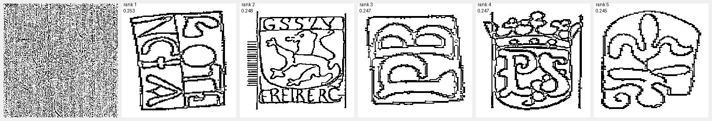
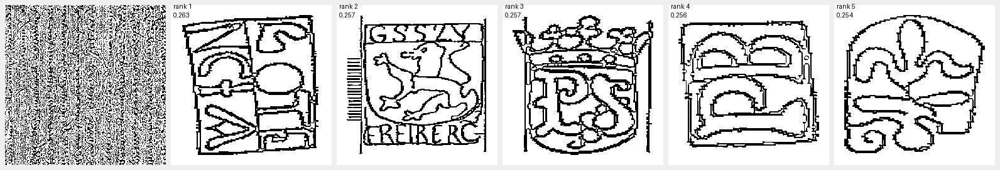
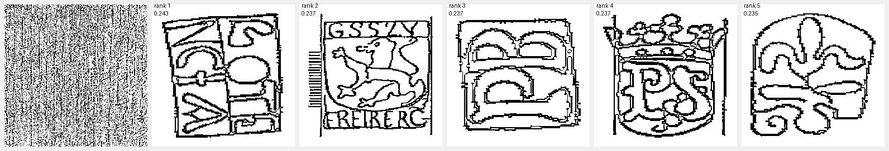

#  Watermark Segmentation and Retrieval System

This repository contains the implementation of a **Deep Learning–based Watermark Detection, Segmentation, and Retrieval Framework**.  
It automates the identification and matching of historical paper watermarks using **semantic segmentation** (U-Net / DeepLabV3) and **feature-based retrieval** (cosine similarity on embeddings).

---

## 📘 Project Overview

Historical paper watermarks are distinctive patterns that help authenticate and date historical manuscripts and artworks.  
This project provides an **end-to-end system** to detect, segment, and retrieve similar watermarks from large collections such as the *Briquet Watermark Archive*.

The workflow includes:

1. **Dataset Preparation** – Cleaning, normalizing, and organizing watermark images.  
2. **Mask Generation** – Automatic binary watermark mask generation (`make_masks.py`).  
3. **Segmentation Model Training** – Training U-Net for watermark segmentation (`train.py`).  
4. **Feature Extraction** – Creating compact watermark embeddings for comparison.  
5. **Watermark Retrieval** – Performing Top-K similarity search (`compare_watermark.py`).  
6. **Evaluation and Visualization** – Measuring accuracy and generating visual panels.  

---

## 📂 Directory Structure

The repository is organized as follows:
Watermark-Retrieval-System/
```
│
├── data/ # Datasets and generated files
│ ├── AllDatasets_pool/ # Raw input document images
│ ├── paired/ # Image–mask pairs for training
│ ├── pred_masks/ # Predicted watermark masks
│ ├── index/ # Feature index files (.npz)
│ └── runs_match/ # Retrieval results (CSV and visual panels)
│
├── models/ # Saved model weights
│ ├── unet_watermark.pth # Trained U-Net model weights
│ └── sam_vit_h_4b8939.pth # Optional pretrained model
│
├── src/ # Core source code
│ ├── make_masks.py # Generates pseudo binary watermark masks
│ ├── train.py # Trains the segmentation model
│ ├── compare_watermark.py # Performs Top-K retrieval
│ ├── score_retrieval.py # Computes retrieval accuracy
│ ├── evaluate.py # Calculates Dice, IoU, and other metrics
│ ├── feature_extraction.py # Extracts watermark embeddings
│ └── visualization.py # Visualizes results and retrieval panels
│
├── figures/ # Example output images for documentation
│ ├── retrieval_panel_1.jpg
│ ├── retrieval_panel_2.jpg
│ └── segmentation_example.jpg
│
├── README.md # Project documentation
├── requirements.txt # Dependencies list
└── .gitignore # Files to ignore in version control
```

---

## ⚙️ Installation

Clone the repository and install all dependencies:

```bash
git clone https://github.com/<your-username>/Watermark-Retrieval-System.git
cd Watermark-Retrieval-System
pip install -r requirements.txt

torch
torchvision
numpy
opencv-python
pillow
tqdm
matplotlib
scikit-learn
```
## Usage Guide
##1️⃣ Generate Binary Masks

Automatically create pseudo binary masks for unannotated images:
```bash
python src/make_masks.py
```
2️⃣ Train the Segmentation Model

Train U-Net or DeepLabV3 on paired images and masks:
```bash
python src/train.py
```
3️⃣ Perform Watermark Retrieval

Retrieve top-K matches for query watermarks:
```bash
python src/compare_watermark.py
```
4️⃣ Evaluate Retrieval Accuracy

Compute Top-K accuracy and save results as CSV:
```bash
python src/score_retrieval.py
```
5️⃣ Visualize Retrieval Results

Display query watermarks and their top matches:
```bash
python src/visualization.py
```
### Evaluation and Optimization
🧮 Segmentation Evaluation
| Metric                        | Accuracy (%) |
| :---------------------------- | :----------: |
| Dice Coefficient              |      89      |
| Intersection over Union (IoU) |      82      |

### Retrieval Evaluation
| Metric          | Accuracy (%) |
| :-------------- | :----------: |
| Top-1 Accuracy  |      71      |
| Top-5 Accuracy  |      85      |
| Top-10 Accuracy |      92      |

### Optimization Techniques:

#### Adaptive learning rate (1e-3 → 1e-5)

1. BCE + Dice Loss for segmentation

2. L2 normalization for consistent embeddings

3. Early stopping & batch normalization.


### Visualization

Each panel displays a query watermark (left) and its Top-5 retrieved matches (right) ranked by cosine similarity.

<p align="center">  <br><em>Figure 1. Visualization of query watermark and Top-5 retrieved matches from the Briquet reference index.</em> </p>
<p align="center">  <br><em>Figure 1. Visualization of query watermark and Top-5 retrieved matches from the Briquet reference index.</em> </p>
<p align="center">  <br><em>Figure 1. Visualization of query watermark and Top-5 retrieved matches from the Briquet reference index.</em> </p>

#### References

1. Bradley, D. & Roth, G. (2007). Adaptive Thresholding using the Integral Image.

2. Otsu, N. (1979). A Threshold Selection Method from Gray-Level Histograms.

3. Soille, P. (1999). Morphological Image Analysis.

4. Vincent, L. (1993). Morphological Grayscale Reconstruction in Image Analysis.

5. Shen, Y. et al. (2019). Watermark Dataset and Detection in Historical Documents.

6. Bagdanov, A.D. et al. (2012). Document Image Analysis for Watermark Recognition.

## License

This project is part of academic research. For reuse beyond educational purposes, contact the author.


## Author

**Maha Saad**  
Master’s Program in Artificial Intelligence  
Friedrich-Alexander-Universität Erlangen-Nürnberg

